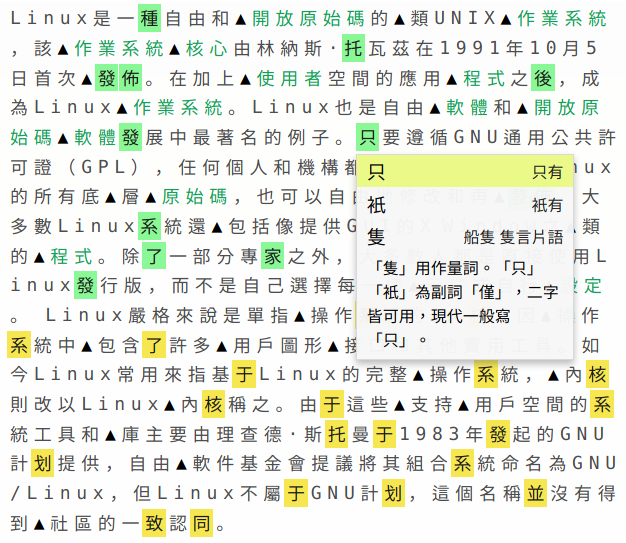
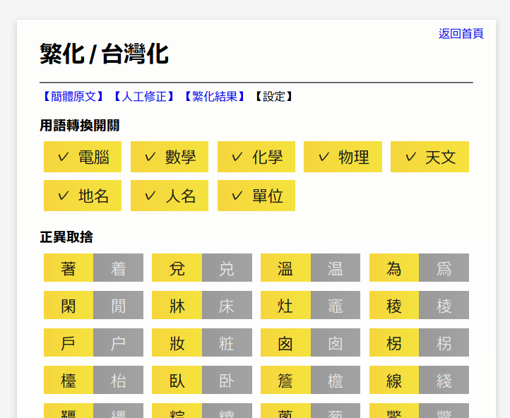

# 精細繁簡轉換工具

## 介紹

眾所周知，機器繁簡轉換存在諸多問題，為了使轉換結果正確無誤，往往需要進行人工校對。而人工校對費時費力，又容易出錯。本程式的目的就是解決這個問題。

みんなご存知のとおり、中国は 1950 年代に「簡体字」を制定し、従来の漢字（いわゆる繁体字）を簡略化しました。この「簡体字」の中には、複数の漢字が一つの漢字に統合された場合があります。なので、コンピュータによる繁体字と簡体字の相互変換はややこしい問題になってしまいました。

與傳統的轉換程式不同，本程式在轉換流程中，增加了「人工修正」這一步驟。程式會標出所有需要進行修正的字，並列出所有的可能以供選擇。用語的轉換亦是基於人工調整的。

このプログラムは、変換の正確性を保つように、人工的な修正を行うことができる仕組みになっています。また、台湾華語と普通話の語彙の相互変換にも対応しています。

（示例文章為：中文維基百科 "Linux" 詞條）

（專門用語轉換收錄類別暫時較少）

另外，除了繁體和簡體之間的轉換，本程式還提供了「日文復原」這一功能，可以復原日文漢字被自動轉換成簡體字的日文文章。

このプログラムは、繁体字中国語と簡体字中国語の相互変換のほか、「簡体字日本語の還元」という機能も持っています。（中国のネット掲示板で、繁体字のスレが簡体字に自動変換されるケースが多いです。そのせいで、日本語の漢字が簡体字に変換されてしまった場合も多いと言われています。そのような日本語を「簡体字日本語」と呼ぶとします。）

本程式原始碼在 MIT 授權條款之下發佈；所用資料的一部分修改自中文維基百科，仍遵循 CC BY-SA 3.0 授權條款發佈；其它注明來源的資料，版權歸原作者所有；其餘的資料，發佈在公有領域。

このプログラムのすべてのソースコードは MIT License の下で公開されています。このプログラムの中で使用されるデータの一部は Wikipedia 中国語版からダンロードして JSON フォーマットに変換されたもので、CC BY-SA 3.0 License を保っています。他のデータの版権はファイルの中で記されている著者にあります。著者が記されていないデータは public domain で公開されています。

Online Test: <a target="_blank" href="https://sinograph.club/convert/">https://sinograph.club/convert/</a>

** 本程式中的 JavaScript 未經 Babel 轉換，故要求瀏覧器支援 ECMAScript 2015 (ES6) 才可以正常使用。

** このプログラムを利用するには、ブラウザの ECMAScript 2015 (ES6) の対応は不可欠となります。
