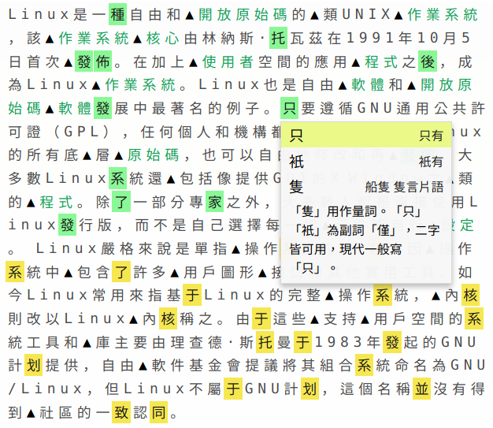

# 精細繁簡轉換工具

## 介紹

眾所周知，機器繁簡轉換存在諸多問題，為了使轉換結果正確無誤，往往需要進行人工校對。而這種人工校對費時費力，又容易出錯。本程式的目的就是解決這個問題。

みんなご存知のとおり、中国は 1950 年代に「簡体字」を制定し、従来の漢字（いわゆる繁体字）を簡略化しました。このような簡体字には、複数の漢字が一つの漢字に統合された場合があります。なので、コンピュータによる繁体字と簡体字の相互変換はややこしい問題になってしまいました。

與傳統的轉換程式不同，本程式在轉換流程中，增加了「人工修正」這一步驟。程式會標出所有需要進行修正的字，並列出所有的可能以供選擇。地區用語的轉換亦是基於人工干預的。

このプログラムは、変換の正確性を保つように、人工的な修正を行うことができる仕組みになっています。また、台湾華語と普通話の語彙の相互変換にも対応しています。

（示例文章為：中文維基百科 "Linux" 詞條 ）

另外，除了繁體和簡體之間的轉換，本程式還提供了「日文復原」這一功能，可以復原日文漢字被自動轉換成簡體字的日文文章。

このプログラムは、繁体字中国語と簡体字中国語の相互変換のほか、「簡体字日本語の還元」という機能も持っています。（中国本土の掲示板などのサイトのなか、繁体字のスレを自動的に簡体字に変換する機能を持つものが沢山あります。そのせいで、日本語の漢字が簡体字に変換されてしまった場合も多いと言われています。そのような日本語を「簡体字日本語」と呼ぶとします。）

